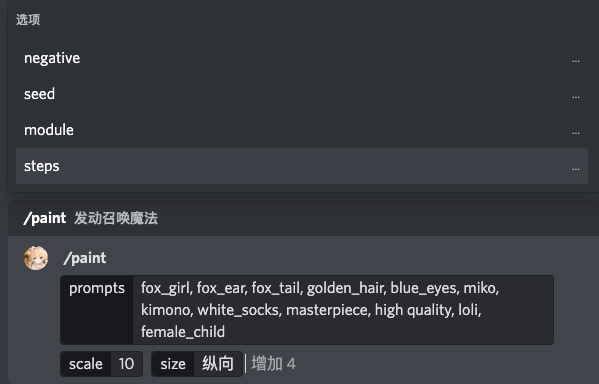

# AIPaintingBot

一个中二的 AI 绘图机器人。

仅限 Discord。

## 示例

机器人支持私聊（DM）和群聊触发。

注意：机器人的交互在群聊中对所有人可见。

### 文字转图片交互



### 计算进度同步


### 计算结果展示
  


### 上采样


### 图片转图片交互

由于 Discord 的 App Command 不支持携带附件，图片转图片需要手工输入`/repaint`命令激活功能。

在参数不足的情况下机器人会通过单独的UI提示你输入更多的参数。

在群聊中，需要`@机器人 /repaint`才能激活命令。


  


## 部署

### 架构


### 前置要求

- 依赖服务
  - [sd_work_node](https://github.com/9chu/sd_work_node)
    - 不低于 6G 显存的 GPU 服务器
    - 在 Tesla P4（7.5G）环境下部署成功，可以工作在中等内存优化级别下
  - [sd_work_manager](https://github.com/9chu/sd_work_manager)
- Python >= 3.6
- 相关模型数据（Checkpoint、Embedding、Hypernetwork），具体见`sd_work_node`配置

### 安装

```bash
python3 -m venv venv
source venv/bin/activate
pip install -r requirements.txt
```

### 配置

- config.json

```json
{
  "bot_token": "DISCORD BOT TOKEN HERE",
  "sd_api_base_url": "https://localhost",
  "sd_api_prefix": "/api",
  "sd_api_secret": "WEB API SECRET HERE",
  "available_modules": [
    "anime",
    "furry_kemono"
  ]
}
```

| 配置项 | 说明                                                           |
| ----- |--------------------------------------------------------------|
| bot_token | 机器人 Token。                                                   |
| sd_api_base_url | 指向 sd_work_manager 的基 URL。                                   |
| sd_api_prefix | sd_work_mananger 的 API 前缀，用于反代环境下修改默认 URL 路径。默认'/api'。       |
| sd_api_secret | sd_work_mananger 提供的 API 的 Secret Key。                       |
| default_negative_prompts | 默认的负面关键词。当使用机器人时，在不提供负面关键词的情况下所用的默认值。你也可以在填写负面关键词时用'$'符号替代这些值。 |
| available_modules | 可用的 Hypernetwork 模组，需要和 sd_work_node 中部署的 Hypernetwork 对应。   |

- https_proxy

当环境变量中配置有该值时，会被用于作为到 discord 的代理地址。

### 启动

```bash
source venv/bin/activate
python3 ./main.py --config ./config.json
```

## 许可协议

MIT License.
